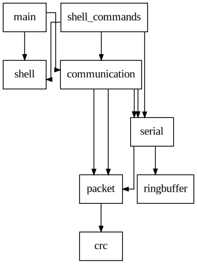
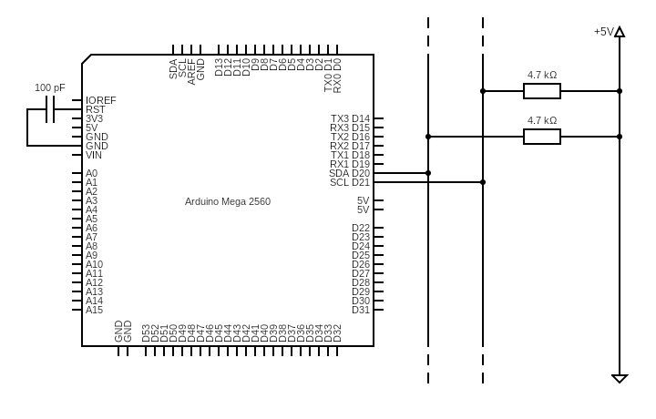
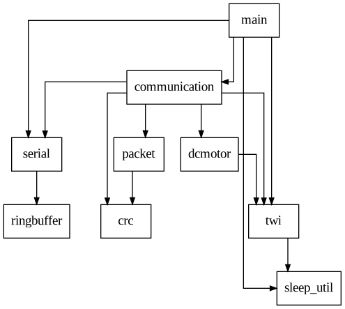
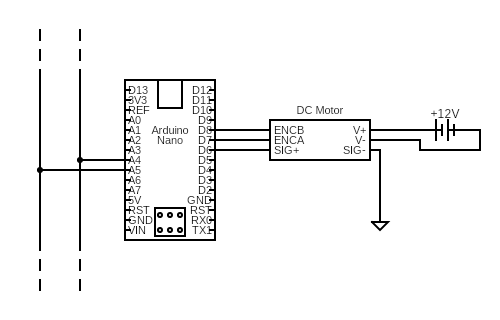
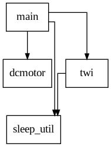

---
title:
- AVR Multi Motor Control
author:
- Paolo Lucchesi
theme:
- PaloAlto
colortheme:
- beaver
---

# Introduction

## What is ammc?

_AVR Multi Motor Control_ is an electrical motor management hardware/software
ecosystem composed of:

* A text-based **client** application
* One **master** controller
* One or more **slave** controllers

## Features

* Text-based client application for POSIX environments
* Master and Slave(s) controller firmware
* Fully binary Client-Master communication protocol on top of the serial interface
* Fully binary Master-Slave communication protocol on top of the I2C interface
* Up to 126 DC motors (limited by 7-bit I2C Slave addressing, 0x00 is reserved)
* Ability to get and set the DC motors speed, individually
* Software defined PID controller embedded in each Slave controller

## Development

* Focus on **modularity**
* Keeping _SOLID_ principles in mind
  - Extensibility through the Open-Close Principle
  - Attention on module call directions following the Single-Responsability Principle
* Exhaustive **documentation** on multiple depths
  - README.md file in the git repository
  - Source code documentation generated with _doxygen_
  - Client application's man page
  - Bachelor degree thesis
* GNU Make build system
* Absence of third-party non-standard libraries

# Client Application

## Features

* Granular handling for getting and setting motors' speed
* Terminal User Interface implemented as a command shell
* Support for non-interactive use (i.e. scripting)
* Communication with master controller using the serial protocol
* Compatible with POSIX-compliant environments
* Comes with a man page

## Software modules

## User Interface

External commands allow to interface the master controller:

* `connect <device-path>`
* `get-speed <motor-id>`
* `set-speed <motor-id>=<speed>`
* `apply`
* `set-slave-addr`

# Master Controller

## Features

* Is itself an **ATMega2560** microcontroller unit
* Interfaces the client applications with the slave controllers
* Communicates with the client via serial
* Communicates with slaves via I2C
* Interrupt-driven communication
* Comes with a power saving policy

## Hardware setup

## Software modules

# Slave Controller

## Features

* Manages a single dc motor
* Execute commands issued by the master controller
* Communicates with the master controller using the **I2C** interface
* Embedded software-defined **Proportional-Integral-Derivative** controller

## Hardware setup

## Software modules

# Client-Master Communication

## Characteristics

* Built on top of the **serial** interface
* Completely binary
* **Packet**-based
* Packet integrity is checked via **CRC-8** checksum
* Interrupt-driven for the master controller

## Packets

Each packet is composed of:

* A **header** containing:
  - Packet id
  - Packet type
  - Whole packet size
  - DC motor selector
* An eventual **body**
* A trailing CRC-8 **checksum**

## Packet types

Type | Actual value
:-:|:-:
`COM_TYPE_NULL`      | `0x00`
`COM_TYPE_HND`       | `0x01`
`COM_TYPE_ACK`       | `0x02`
`COM_TYPE_NAK`       | `0x03`
`COM_TYPE_ECHO`      | `0x04`
`COM_TYPE_TWI_ECHO`  | `0x05`
`COM_TYPE_GET_SPEED` | `0x06`
`COM_TYPE_SET_SPEED` | `0x07`
`COM_TYPE_APPLY`     | `0x08`
`COM_TYPE_DAT`       | `0x09`
`COM_TYPE_SET_ADDR`  | `0x0A`
`COM_TYPE_LIMIT`     | `0x0B`

# I2C Communication

## Features

* Master-Slave architecture
* Completely binary
* **Interrupt-driven** for both master and slaves
* **Broadcasting** capabilities through the _general-call address_ `0x00`
* Follows the original Philips I2C specification (year 2000)

## Communication Frames

The communication frames is composed of two parts:

* A heading byte representing the master **command**
* An optional command **argument**

Command | Code
:-:|:-:
`DC_MOTOR_CMD_GET`   | `0x00`
`DC_MOTOR_CMD_SET`   | `0x01`
`DC_MOTOR_CMD_APPLY` | `0x02`
`TWI_CMD_ECHO`       | `0x03`
`TWI_CMD_SET_ADDR`   | `0x04`
